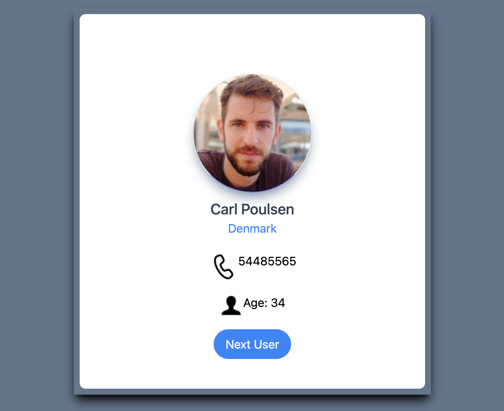

# Random User project using ReactJS

This simple project was built with some tools such us:
* React v17.0.2
* TailwindCSS v3.0.23
* API Random user [Link](https://randomuser.me/).

## Steps to run the project:

1. Clone the project from GitHub.If you have installed git your pc or you can download it directly from github.

``` bash
$ git clone https://github.com/JuanGuevara90/RandomUser-ReactJS.git
```
2. Install dependencies to the project.
``` bash
$ npm install
```
3. If you want to run this app.\
Open [http://localhost:3000](http://localhost:3000) to view it in your browser.
``` bash
$ npm run
```

> **Note:** if you want to build the app, you could run this command : `nmp run build`
## Preview project
